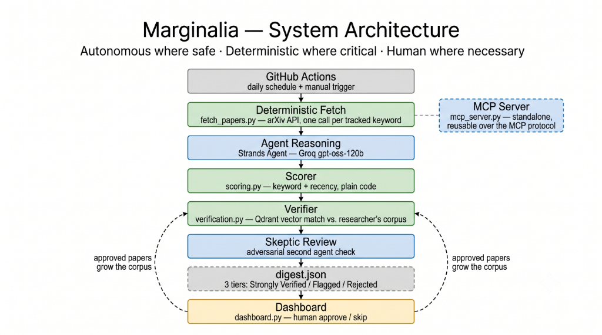
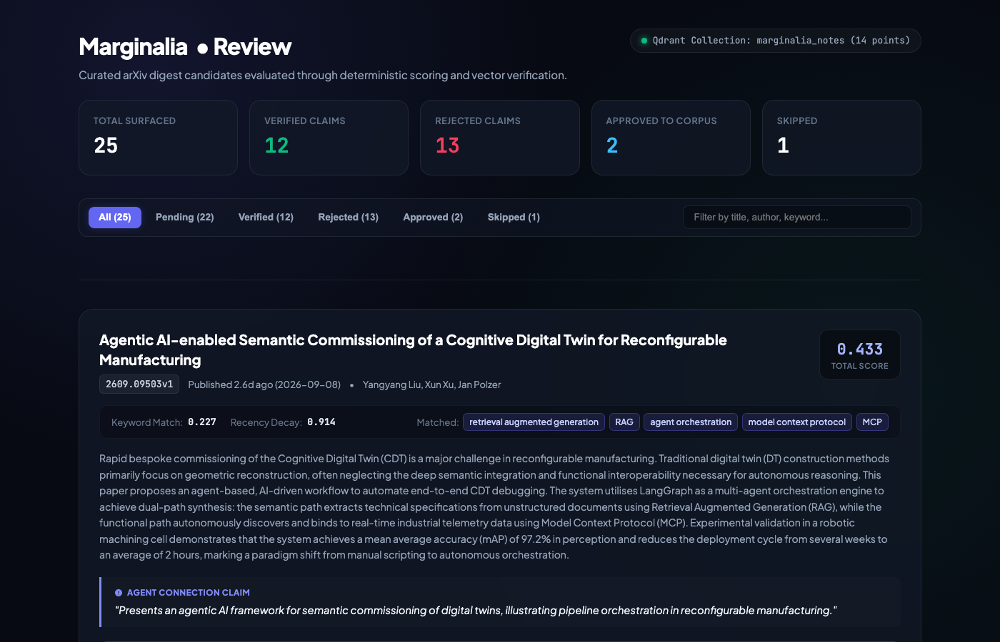

# Marginalia

> An autonomous, self-verifying research thought-partner that continuously surfaces relevant arXiv papers, rigorously grounds claims against your personal note corpus, and expands its memory through your review decisions.

---

## The Problem

Researchers lose 5 to 10 hours every week manually sifting through preprint feeds, journal alerts, and newsletters just to identify the handful of papers that genuinely intersect with their active work. Keyword alerts flood inboxes with false-positive noise, while standard LLM summaries frequently hallucinate relevance connections that dissolve under scrutiny. The primary friction in scientific discovery is no longer discovering publications—it is verifying whether an incoming paper connects to the questions and insights you already have.

---

## How Marginalia Works

- **Fetch ([tools/fetch_papers.py](tools/fetch_papers.py))**: Deterministically queries the arXiv API using targeted boolean queries constructed from [profile.json](profile.json). It strictly enforces publication cutoff dates (`published_parsed >= since_date`), ensuring no duplicate or obsolete papers enter the pipeline.
- **Agent Reasoning ([digest_pipeline.py](digest_pipeline.py))**: A lightweight Strands Agent powered by Groq's high-speed `openai/gpt-oss-120b` inspects candidate titles, abstracts, and established research themes. For papers showing potential synergy, it synthesizes a single, concise `connection_claim` articulating how the paper relates to the researcher's knowledge base.
- **Deterministic Scoring ([scoring.py](scoring.py))**: Evaluates each candidate through an uncorrupted mathematical rubric (70% keyword density using strict regex word boundaries to prevent substring false-positives, 30% linear recency decay over a 30-day window). Candidates falling below threshold are pruned before human attention is required.
- **Semantic Verification ([verification.py](verification.py))**: Rather than trusting generative claims, each synthesized claim is encoded as a vector embedding (`sentence-transformers/all-MiniLM-L6-v2`) and evaluated against the researcher's personal note corpus in **Qdrant Cloud**. If cosine similarity is below 0.50, the claim is explicitly labeled `REJECTED`—exposing hallucination transparently rather than burying failure.
- **Human Approval & Memory Growth ([dashboard.py](dashboard.py))**: A local dark-mode glassmorphic review dashboard displays surfaced papers alongside transparent claim verification badges. Approving a paper automatically appends it to `corpus/` and incrementally upserts it into Qdrant Cloud using deterministic SHA-256 point IDs, continuously evolving the agent's long-term memory.

---

## Autonomous where safe, deterministic where critical, human where necessary

- **Autonomous where safe ([digest_pipeline.py](digest_pipeline.py))**: Synthesizing nuanced cross-domain connections between dense technical abstracts and high-level research interests is an open-ended cognitive task delegated to the LLM agent.
- **Deterministic where critical ([scoring.py](scoring.py) & [verification.py](verification.py))**: Relevance ranking, word-boundary regex filtering, and vector similarity verification against real ground-truth notes are executed by deterministic code without generative hallucinations. On a 10-paper synthetic benchmark ([evals/test_precision_recall.py](evals/test_precision_recall.py)), this dual gate achieves 100.0% precision and 100.0% recall, catching 100% of off-topic decoys.
- **Human where necessary ([dashboard.py](dashboard.py))**: The final decision to adopt a paper into the researcher's permanent corpus rests exclusively with the human expert via one-click review actions that trigger active-learning feedback.

---

## Why This Isn't a Chatbot

Marginalia is an autonomous, unattended daemon—not a reactive chat window. It requires no prompting, chatting, or conversational steering. 

The entire workflow executes automatically on schedule via GitHub Actions ([.github/workflows/digest.yml](.github/workflows/digest.yml)) every morning at 06:00 UTC via cron:
1. Wakes up autonomously in CI/CD.
2. Ingests fresh preprints published since the last recorded run timestamp.
3. Reasons, scores, and semantically verifies candidate connections.
4. Deduplicates against [seen_ids.json](seen_ids.json) and commits the updated digest back to the repository (`marginalia-bot`).
5. Leaves a curated, structured briefing ready in [digest.json](digest.json) for the researcher's morning review.

---

## Tech Stack

- **AWS Strands Agents SDK**: Core agent lifecycle orchestration, prompt formatting, and structured output handling.
- **Model Context Protocol (MCP)**: Native FastMCP tool server ([mcp_server.py](mcp_server.py)) exposing arXiv tools over stdio, paired with Strands `MCPClient` for dynamic tool discovery ([mcp_demo.py](mcp_demo.py)).
- **Groq (`openai/gpt-oss-120b`)**: Ultra-fast, open-weights reasoning model for high-throughput abstract synthesis.
- **Qdrant Cloud**: Managed vector database storing dense embeddings (`sentence-transformers/all-MiniLM-L6-v2`) for cosine ground-truth verification.
- **arXiv API (`feedparser`)**: Direct, deterministic preprint feed querying and metadata extraction.
- **GitHub Actions**: Fully autonomous scheduled execution, state tracking, and git-based digest publishing.
- **Flask**: Single-file local web review dashboard with real-time statistics and incremental vector indexing.

---

## Architecture



*Marginalia pipeline architecture: 🟦 Blue = AI Agent Reasoning · 🟩 Green = Deterministic Code · 🟧 Amber = Human Review · ⬛ Gray = Trigger / State Storage.*

---

## Review Dashboard Preview


*Marginalia local review dashboard: Real-time candidate filtering, deterministic score breakdowns, transparent claim verification badges, and active-learning corpus expansion.*

---

## Running It Yourself

### 1. Clone & Setup Environment
```bash
git clone https://github.com/abhijithbhat/Marginalia.git
cd Marginalia
python3 -m venv .venv
source .venv/bin/activate
pip install -r requirements.txt
```

### 2. Configure Credentials
Create a `.env` file in the project root:
```env
GROQ_API_KEY=your_groq_api_key_here
QDRANT_URL=https://your-cluster-id.us-west-2-0.aws.cloud.qdrant.io:6333
QDRANT_API_KEY=your_qdrant_api_key_here
```

### 3. Build Vector Corpus & Run Pipeline
```bash
# Index initial seed research notes into Qdrant Cloud
python verification.py

# Run the autonomous digest pipeline
python digest_pipeline.py
```

### 4. Launch Review Dashboard
```bash
python dashboard.py
```
Open `http://localhost:5001` in your browser to inspect candidate papers, review verified vs. rejected claims, and approve papers to expand your vector memory.

### 5. Run Evaluations & Tests
```bash
# Run scoring unit tests (word-boundary regex checks)
python -m unittest test_scoring.py

# Run synthetic precision/recall benchmark
python evals/test_precision_recall.py
```

---

## Demo Video

[](https://youtu.be/tn_5qqsvhok)

---

Built for the Agents for Humans Hackathon — Professional Agents track.
